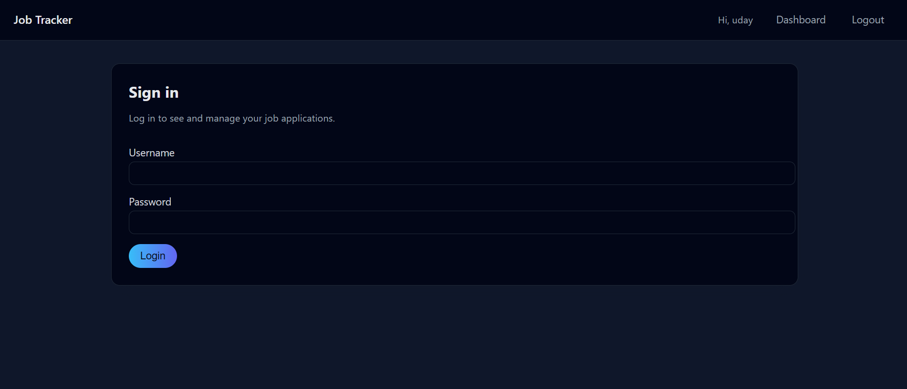
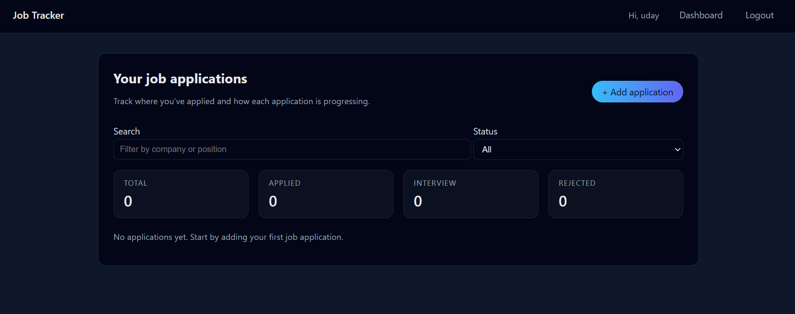
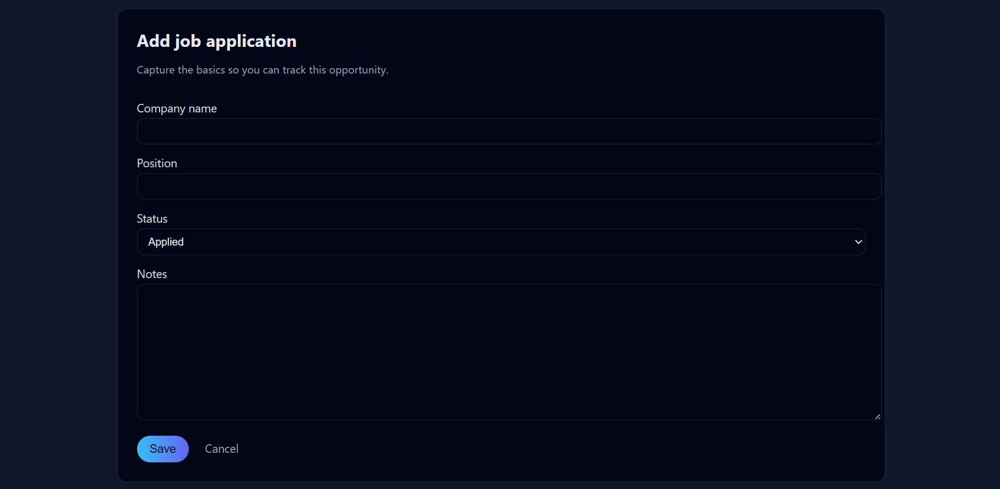

 Job Tracker (Django Project)

A web application built using Django to track job applications and manage job search efficiently.

---

 📌 Features

* Add job applications
* Update job status (Applied, Interview, Selected, Rejected)
* Dashboard to view all jobs
* Django admin panel

---

 🛠️ Tech Stack

* Python
* Django
* SQLite
* HTML, CSS, JavaScript

---

⚙️ Installation

1. Clone repository:
   git clone https://github.com/udaykumar24-A/Git.git

2. Navigate to project:
   cd Job-tracker

3. Create virtual environment:
   python -m venv .venv

4. Activate environment:
   .venv\Scripts\activate

5. Install dependencies:
   pip install -r requirements.txt

6. Run migrations:
   python manage.py migrate

7. Start server:
   python manage.py runserver

---

📷 Screenshots

🏠 Home Page

📊 Dashboard

➕ Add Job

---

 📁 Project Structure

Job tracker/
│── manage.py
│── jobtracker/
│── tracker/
│── templates/

---

🙋‍♂️ Author

Uday Kumar

---

📢 Future Improvements

* User authentication system
* Notifications
* Deploy to cloud

---

 ⭐ Live Demo

(Add your Render link here after deployment)
